<h1 align="center">INACODEX</h1>

Christian Castro Iglesias

Adán Otero López

Iván Duro Fernández

## Índice
- [Introducción](#introducción)
- [Manual técnico para desarrolladores](#Manualtécnicoparadesarrolladores)
- [Horas Invertidas](#HorasInvertidas)

## ⚡Introducción⚡
Este es un programa / app que gestiona con consultas los algunos de los personajes
de la serie Inazuma Eleven mediante una base de datos en MySQL.

El usuario al iniciar la aplicación tendrá tres opciones, registrarse, en la que
tendrá que indicar un nombre y una contraseña para poder acceder, iniciar sesión,
en la que tendrá que indicar sus credenciales para acceder y invitado que podrá acceder
sin ninguna credencial. 

Una vez dentro, podrá crear, modificar y eliminar personajes además
de consultar la información proporcionada por el programa en la base de datos 

---

## ⚡Manual técnico para desarrolladores⚡

## Requisitos
- **Java SE 17 o superior**: El proyecto se desarrollo usando Java 17, por lo cuál, se necesita
esta versión o superiores para poder iniciar el programa [(descargar)](https://www.oracle.com/java/technologies/javase/jdk17-archive-downloads.html)
- **Ant**: También, este proyecto se realizó en Java con Ant, por lo que se deberá tener Ant instalado
[(descargar)](https://ant.apache.org/)
- **MySQL**: Para la base de datos, se utilizó MySQL como sistema de gestión de bases de datos, si no se tiene,
habría que instalarlo [(descargar)](https://dev.mysql.com/downloads/mysql/)
- **IDE Utilizado**: Por último, el proyecto de desarrollo en el IDE Netbeans, si no se tiene instalado, no hace falta
instalarlo porque se puede utilizar cualquier otro IDE compatible con Java, pero se recomiendo utilizar el
anteriormente mencionado [(descargar)](https://netbeans.apache.org/front/main/index.html)

---

## ⚡Modelo Entidad-Relación⚡

  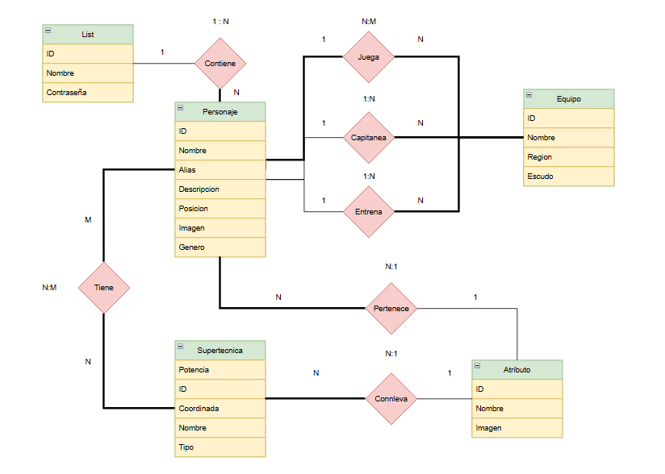

Los requisitos del programa según el modelo entidad-relación son los siguientes:

Un **Usuario** (lista) se define por un ID, un nombre y una contraseña. Cada Lista contiene uno o varios personajes, y cada **Personaje** pertenece a una única Lista (relación 1:N Contiene).

Un **Personaje** se define por un ID, nombre, alias, descripción, posición, imagen y género.
Los **Personajes** se relacionan con Equipos de varias formas:
- Un **personaje** juega en uno o varios equipos y un equipo puede tener uno o varios personajes (relación N:M Juega).
- Un **personaje** puede capitanear uno o varios equipos, y cada equipo tiene un único capitán (relación 1:N Capitanea).
- Un **personaje** puede entrenar uno o varios equipos, y cada equipo tiene un único entrenador (relación 1:N Entrena).

Un **Equipo** se define por un ID, nombre, región y escudo.

Los **Personajes** pueden tener Supertécnicas:
- Un **personaje** puede tener una o varias supertécnicas, y una supertécnica puede pertenecer a uno o varios personajes (relación N:M Tiene).

Una **Supertécnica** se define por ID, nombre, potencia, coordenada y tipo.
Tanto los **Personajes** como las **Supertécnicas** se relacionan con Atributos:
- Un **personaje** pertenece a un único atributo, y un atributo puede estar asociado a varios personajes (relación N:1 Pertenece).
- Una **supertécnica** conlleva un único atributo, y un atributo puede estar asociado a varias supertécnicas (relación N:1 Conlleva).
- Un **Atributo** se define por un ID, nombre e imagen.

---

## ⚡Tablas⚡

### ENTIDADES
Usuario: `3`
| NOMBRE | TIPO DE DATO | PERMITE NULL | CLAVE PRIMARIA | CLAVE FORANEA |
| --- | --- | --- | --- | --- |
| `ID` | INT | NO | SÍ | - |
| `NOMBRE` | VARCHAR(30) | NO | - | - |
| `CONTRASENHA` | VARCHAR(60) | SÍ | - | - |

ATRIBUTO: `3`
| NOMBRE | TIPO DE DATO | PERMITE NULL | CLAVE PRIMARIA | CLAVE FORANEA |
| --- | --- | --- | --- | --- |
| `ID` | INT | NO | SÍ | - |
| `NOMBRE` | VARCHAR(35) | NO | - | - |
| `IMAGEN_TIPO_ATRIBUTO` | VARCHAR(200) | SÍ | - | - |

Personaje: `9`
| NOMBRE | TIPO DE DATO | PERMITE NULL | CLAVE PRIMARIA | CLAVE FORANEA |
| --- | --- | --- | --- | --- |
| `ID` | INT | NO | SÍ | - |
| `NOMBRE` | VARCHAR(35) | NO | - | - |
| `ALIAS` | VARCHAR(25) | SÍ | - | - |
| `DESCRIPCION` | VARCHAR(100) | SÍ | - | - |
| `POSICION` | VARCHAR(5) | SÍ | - | - |
| `GENERO` | VARCHAR(20) | SÍ | - | - |
| `IMAGEN` | VARCHAR(200) | SÍ | - | - |
| `ID_ATRIBUTO` | INT | SÍ | - | SÍ |
| `ID_USUARIO` | INT | SÍ | - | SÍ |

EQUIPO: `6`
| NOMBRE | TIPO DE DATO | PERMITE NULL | CLAVE PRIMARIA | CLAVE FORANEA |
| --- | --- | --- | --- | --- |
| `ID` | INT | NO | SÍ | - |
| `NOMBRE` | VARCHAR(35) | NO | - | - |
| `REGION` | VARCHAR(25) | NO | - | - |
| `ESCUDO` | VARCHAR(200) | SÍ | - | - |
| `ID_CAPITAN` | INT | SÍ | - | SÍ |
| `ID_ENTRENADOR` | INT | SÍ | - | SÍ |

SUPERTECNICA: `6`
| NOMBRE | TIPO DE DATO | PERMITE NULL | CLAVE PRIMARIA | CLAVE FORANEA |
| --- | --- | --- | --- | --- |
| `ID` | INT | NO | SÍ | - |
| `NOMBRE` | VARCHAR(35) | NO | - | - |
| `COORDINADA` | BOOLEAN | NO | - | - |
| `POTENCIA` | VARCHAR(25) | NO | - | - |
| `TIPO` | VARCHAR(35) | NO | - | - |
| `ID_ATRIBUTO` | INT | SÍ | - | SÍ |

## RELACIONES N:M

JUEGA: `2`
| NOMBRE | TIPO DE DATO | PERMITE NULL | CLAVE PRIMARIA | CLAVE FORANEA |
| --- | --- | --- | --- | --- |
| `ID_PERSONAJE` | INT | NO | SÍ | PERSONAJE(ID) |
| `ID_EQUIPO` | INT | NO | SÍ | EQUIPO(ID) |

TIENE: `2`
| NOMBRE | TIPO DE DATO | PERMITE NULL | CLAVE PRIMARIA | CLAVE FORANEA |
| --- | --- | --- | --- | --- |
| `ID_PERSONAJE` | INT | NO | SÍ | PERSONAJE(ID) |
| `ID_SUPERTECNICA` | INT | NO | SÍ | SUPERTECNICA(ID) |

---

## ⚡Estructura⚡

Este proyecto se realizó siguiendo el patrón **MVC** (Modelo-Vista-Contolador) visto en clase:

  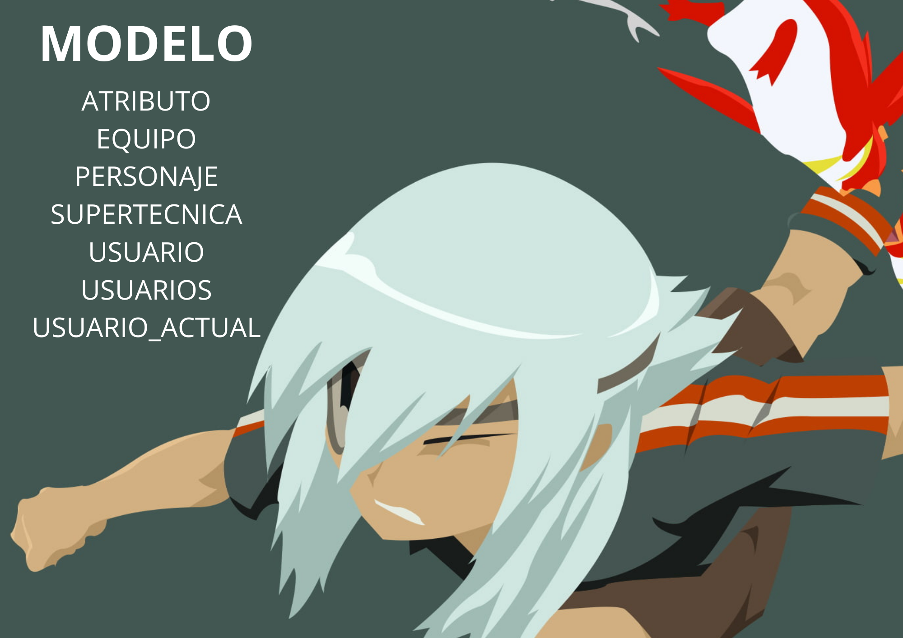

  

  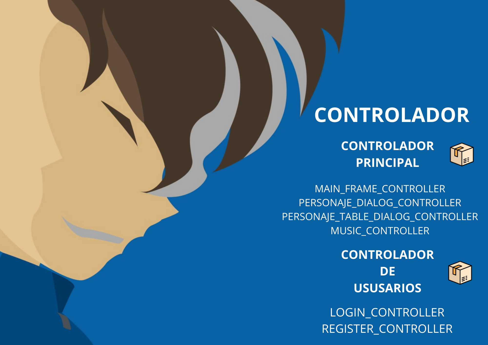

---

## ⚡Ejecución del proyecto⚡
Desde su IDE favorito tendrá que:
1. Descargar el proyecto desde el github
2. Asegurarse que tiene todos lo requisitos necesarios que se mencionaron anteriormente
3. Ejecutar la clase **Inazuma.java** para poder iniciar la aplicación

---

## ⚡Manual de Usuario ⚡

Cuando inicia la aplicación lo primero que se ve, como bien muestra la imagen, es una ventana en la que puedes:
- **Iniciar Sesión**
- **Registrarte**
- Acceder como **Invitado**

Cada usuario puede ver sus propios personajes y no los de los demás, en cambio, cuando inicias como invitado, cualquier usuario puede acceder sin tener que registrarse y a su vez, ver algunos personajes que proporciona la aplicación.

  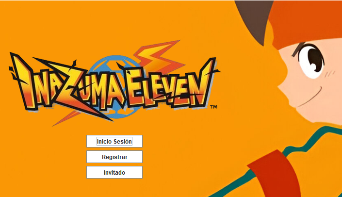

Para registrarse, basta con darle al botón de **Registrarse** y cubrir los campos de **Nombre** y **Contraseña**

  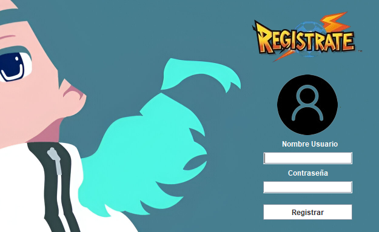

Si por algún motivo, se intenta registrar con uno o los dos campos vacíos, el programa mostrará un error en la que indicará que el usuario tiene que rellenar todos los campos

  

Si todo va bien, y se cubrieron todos los campos, el programa lanzará otra mensaje diciendo que el regitro fue exitoso

  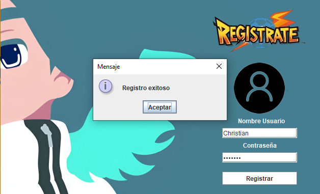

Para iniciar sesión, habría que cubrir los campos de **Nombre** y de **Contraseña** para acceder a la pantalla principal

  

En el siguiente video se muestra como se intena iniciar sesión con el usuario **Christian**, que fue anteriormente registrado, pero como se pone mal la contraseña no le deja iniciar, luego al poner la credencial bien, ya nos dejaria acceder para ver los personajes

  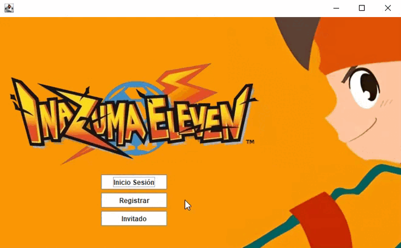

Una vez ya estemos logueados, lo botones de **Iniciar Sesión**, **Resgistrarse** y **Acceder como Invitado** se ocultan y se muestra un MenuBar, como se muestra en la imagen, llamado **Opciones**, en la que podemos ver los personajes o salir de la aplicación, y a la drecha, se muestra el nombre del usuario que tiene la sesión iniciada en ese momento

  

Como bien se menciono antes, hay dos formas de ver los personajes, accediendo como **Invitado**, en la que puedes ver todos los personajes del programa o **Iniciando Sesión**, en la que pudes ver **TUS** personajes y no los de los demás. A continuación se mostrarán imágenes de las dos formas:

## ⚡Accediendo como Invitado:⚡

Cuando pinchas en ver los personajes se te muestra ka siguiente ventana, que son los personaje que trae implementado la aplicación

  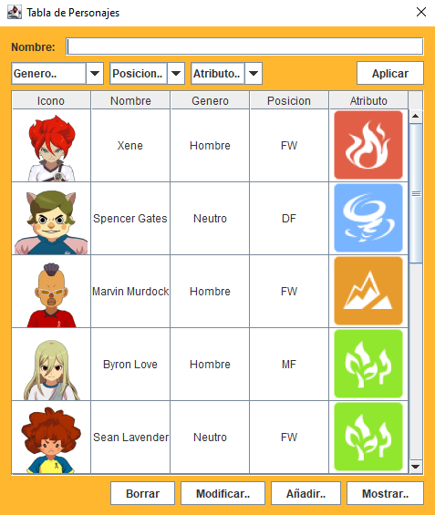

Todo el mundo pude ver la informacion de estos, modificarlos, borrarlos e incluso añadir algunos para que los demás los vean, pero si se desea mostrar la informacion de alguno, borrarlo o modificarlo, habrá que seleccionar el personaje, si no es así, se mostrá un mensaje recordando que habrá que seleccionarlo

  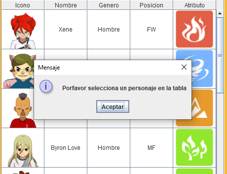

Si se quiere borrar un personaje, el programa lanzará un mensaje de confirmación para que el usuario responda a si quiere borrar ese personaje

  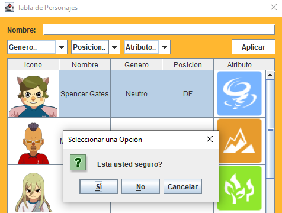

Para mostrar la información, basta con seleccionar el personaje deseado y pulsar el botón **Mostrar**, como se ve en la imagen, la información de los personaje son: Nombre, Alias, Descripción, Supertécnicas, Equipos, Entre otras

  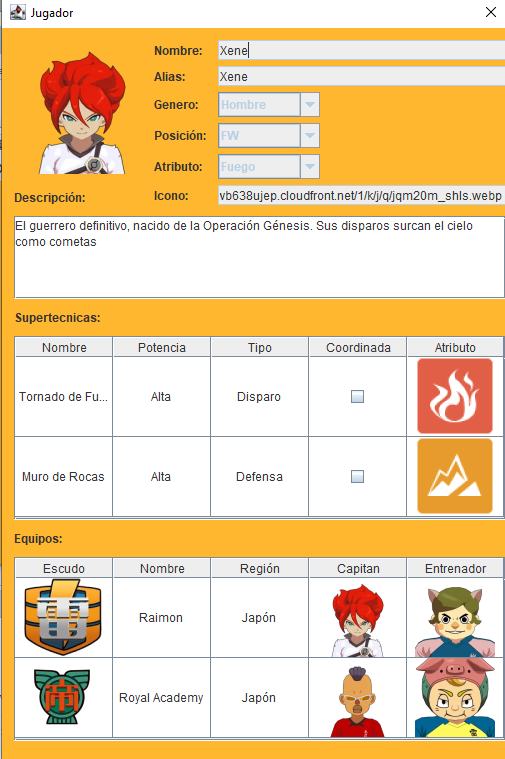

Para modificar, abajo se muestra un video de como se elimina una supertecnica del personaje **Xene**, y se añade otra distinta verificando después que los cambios se hayan realizado correctamente

  

Y por último, está añadir personaje, en el que si se pulsa en el botón **Añadir** se abrirá una pertaña, en la que, habrá que realizar una serie de campos para poder añadir un personaje, una vez añadido, saldrá actualizado en la lista de personajes

  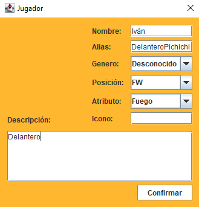
  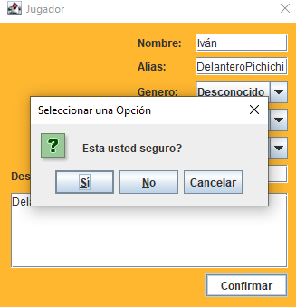

  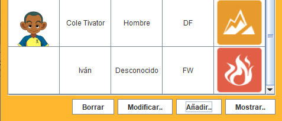

Luego, en la parte de arriba, se puede filtrar esos personajes, primero, como se muestra en la imagen, se filtra, solamente por nombre

  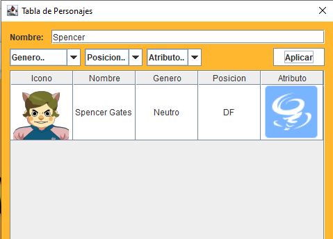

Aparte del filtrado por **Nombre**, tanbién se puede filtrar por, **Género**, **Posición** y por **Atributo**, abajo se muestra un ejemplo de como se filtra por esos campos

  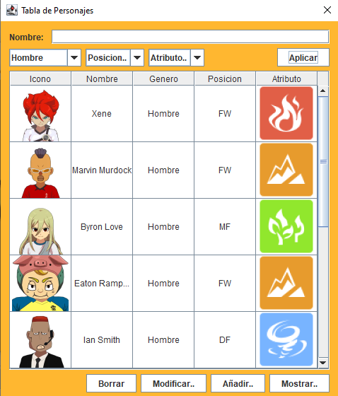
  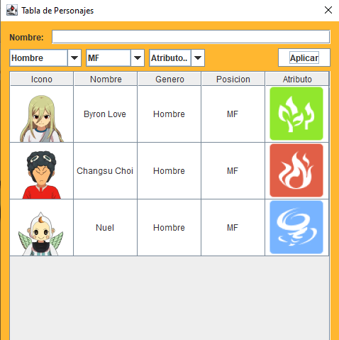

  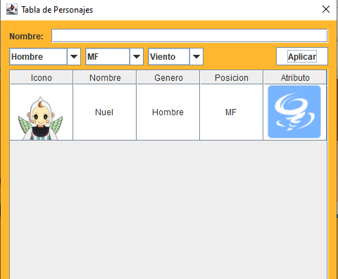

>Cabe destacar que todas las opciones mencionadas para el usuario Invitado también están disponibles para el usuario Normal/Registrado. Por este motivo, no se repetirán algunas en la siguiente explicación, ya que realizan exactamente la misma función.

## ⚡Accediendo como Usuario Registrado:⚡

Ahora se verá como se muestran los personajes de un usuario normal. La primera vez que te registras, como bien se muestra en la imagen, no tendrás ningún personaje en la tabla, ya que tienes que crearlo para que se pueda mostrar

  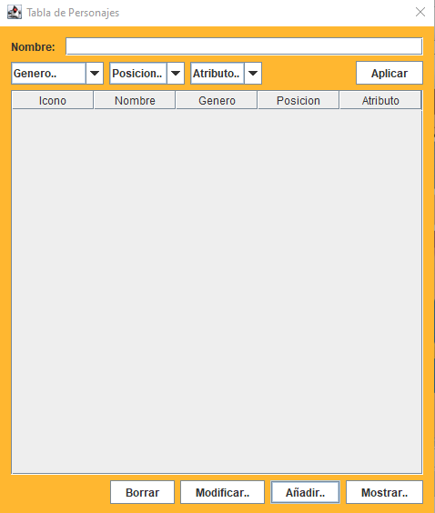

Para poder crear un personaje, como bien se explico antes, hanrá que pulsar el botón se añadir y cubrir una serie de campos que pide el programa

  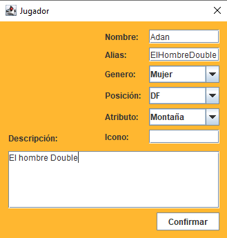

Una vez cubiertos los campos, se mostrará un mensaje de confirmación en el que te preguntará si deas guardar el personaje creado

  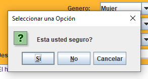

Ya creado, ahora si que se muestra en la lista. Ese personaje, solo lo puede ver ese usuario, si se desea iniciar sesión con otro distinto, no tendrá la opción de verlo

  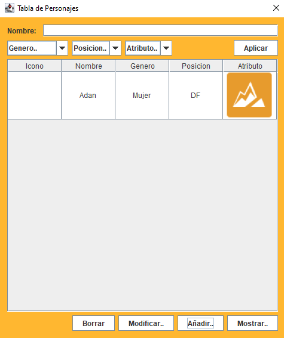

Para contrastrar la información que se inserto antes, solo habrá que pulsar el botón de mostrar, con el personaje seleccionado para ver que toda la información es correcta

  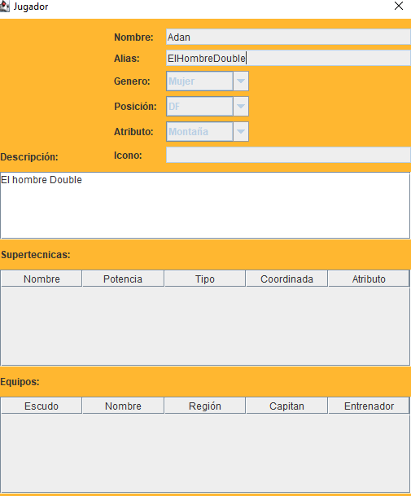

---

## ⚡Extras⚡

1 - Cifrado de contraseña de usuarios de la base de datos

2 - Diseñar ventana para que el admin pueda gestionar usuarios desde la propia aplicación

3 - Botón interno para controlar el volumen de la canción de fondo de la propia aplicación

4 - Mejorar la infraestructura eléctrica de Galicia

---

## ⚡Reparto de tareas⚡
**Christian** - Conexión de base de datos, sentencias sql, diagrama en draw.io, modelo de datos en Java, diseño de las funciones CRUD, monitorización del correcto desarrollo de la aplicación

**Adán** - Creación de las interfaces, creación de los controladores, investigacion y adquisicion de las librerias requeridas, incorporación de las funciones CRUD previamente diseñadas

**Iván** - Script de cracion de la base de datos, inserción de datos por defecto de la base de datos, gestion de usuarios de la aplicación, personalización de la interfaz y creación del Readme

**TODOS** - Analizar requerimientos y funciones necesarias, apoyo moral de los demás integrantes

## ⚡HORAS INVERTIDAS: ⚡
30 horas de media por cada integrante + horas de clase
